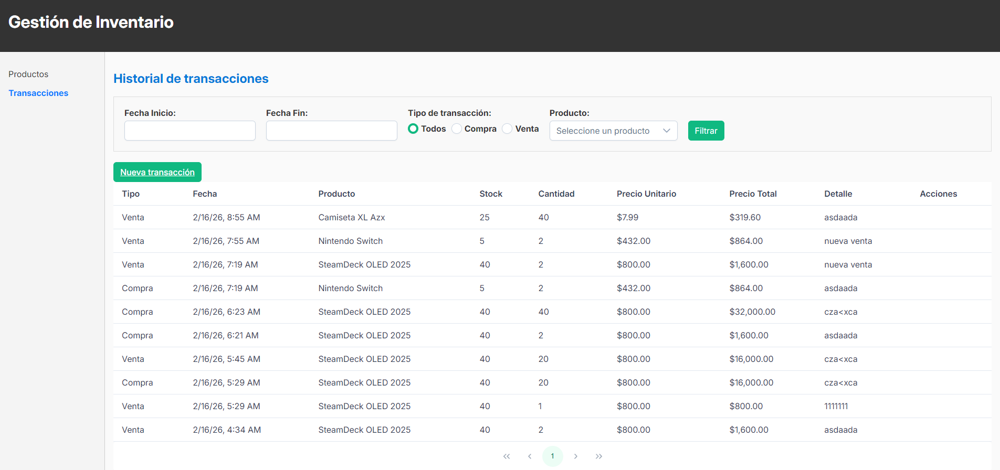
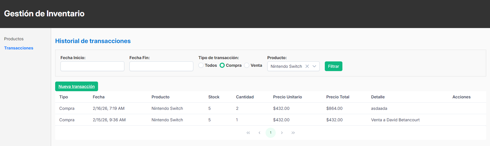
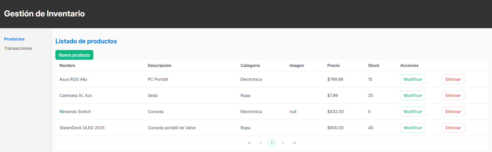
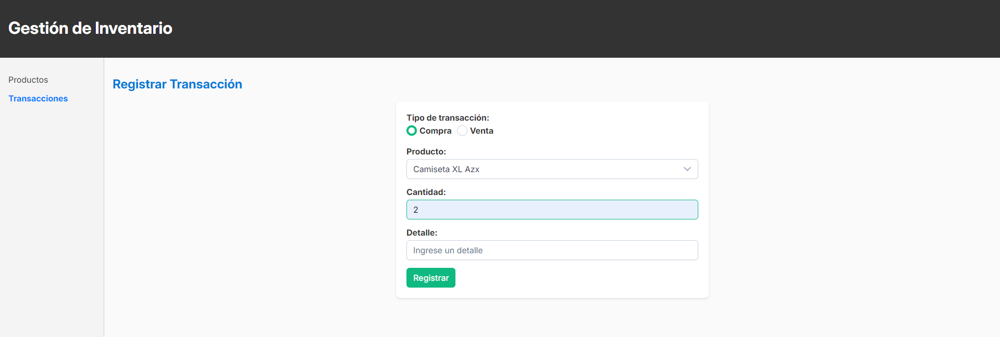
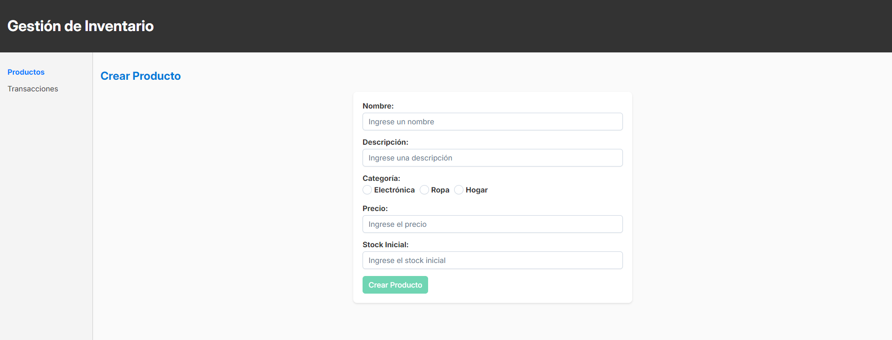

# Proyecto Prueba Produbanco

## Requisitos

Para ejecutar este proyecto en un entorno local, asegúrese de tener instalados los siguientes requisitos:

### Backend

- .NET 10
- SQL Server
- Visual Studio 2026

### Frontend

- Node.js (versión 16 o superior)
- Angular CLI (versión 19 o superior)
- Navegador web moderno (Google Chrome, Firefox, Edge, etc.)

## Ejecución del Backend

1. Clonar el repositorio:

   ```bash
   git clone https://github.com/ddavebet/prueba-produbanco.git
   cd prueba-produbanco/backend
   ```

2. Navegar a la carpeta `scripts` y ejecutar los scripts `producto-db.sql` y `transaccion-db.sql` para crear las bases de datos requeridas. Asegúrese de que los scripts se ejecuten sin errores antes de continuar.

3. Abrir la solución `Inventario.slnx` en Visual Studio 2026.

4. Configurar la cadena de conexión a las bases de datos en el archivo `appsettings.json` dentro de las carpetas `ProductoService.Api` y `TransaccionService.Api`.

5. Ejecutar los proyectos `ProductoService.Api` y `TransaccionService.Api` desde Visual Studio o utilizando el siguiente comando en la terminal:

   ```bash
   dotnet run --project ProductoService/ProductoService.Api/ProductoService.Api.csproj
   dotnet run --project TransaccionService/TransaccionService.Api/TransaccionService.Api.csproj
   ```

6. Verificar que los servicios estén corriendo en los puertos configurados en los archivos `launchsettings.json`.

## Ejecución del Frontend

1. Navegar al directorio del frontend:

   ```bash
   cd frontend/inventario-web-app
   ```

2. Instalar las dependencias del proyecto:

   ```bash
   npm install
   ```

3. Ejecutar la aplicación Angular:

   ```bash
   ng serve
   ```

4. Abrir un navegador web y acceder a la URL:
   ```
   http://localhost:4200
   ```

## Evidencias

A continuación, se presentan algunas capturas de pantalla que demuestran la funcionalidad del sistema:

### Captura 1: Historial de transacciones



### Captura 2: Filtro dinámico de transacciones



### Captura 3: Listado de productos



### Captura 4: Registro de transacción



### Captura 5: Crear producto

